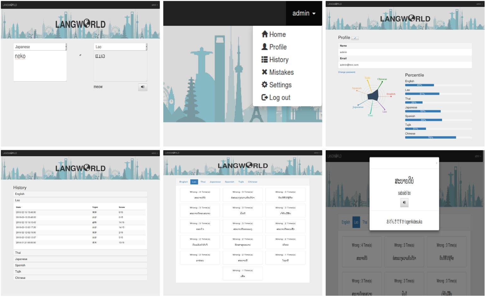

# LANGWORLD
Languages learning web application called Langworld
##   

## Setup
### Prerequisites
- PHP
- Apache2
- MySQL

**To setup the environment run**

`bash setup.sh`

### Setup Database
```
mysql -u root -p
source sqlFile.sql;
```
*If error about characters appear, run the following command and run sql file again.*

`Set character_set_server=utf8;`

*Choose Database*

`use teamEdb;`

*You can test if database works correctly by:*

`select * from topics;`

## Run
`php -S localhost:8000`
